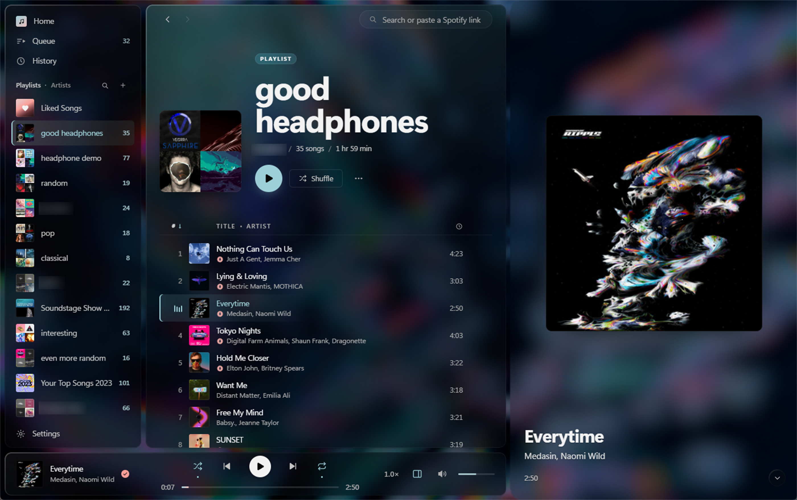
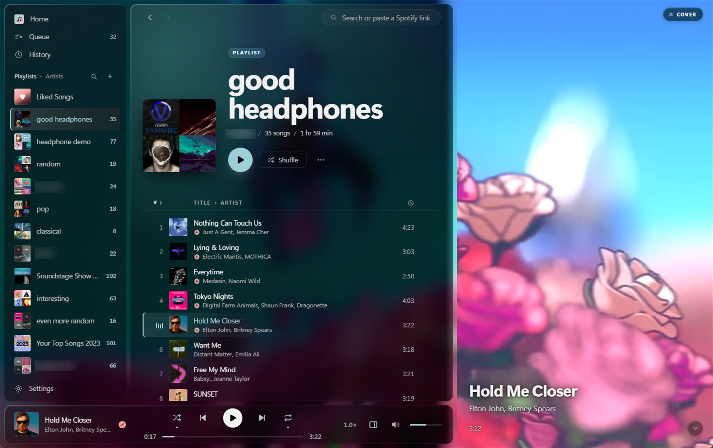

# Renderer

A desktop Spotify client for Windows. I built it because the official app used
more CPU than I want a music player to use. My computer has a liquid-cooled
Ryzen 9 5950X, and the native desktop app would constantly boost it to 80 °C.
WTF? Literal benchmarks that use all cores at max don't go that high. A music
player is constantly open, and randomly spinning my CPU to absurd temps is
insane, so I had to make this. It's worse if you have open-back headphones,
because you need your PC to be as silent as possible — every time I started a
song in the normal Spotify app it would spin my fans and distract me.

<p align="center">
  
  <br><br>
  
</p>

## Install

Grab the setup from [Releases](../../releases) and run it. It's an ordinary
Windows install wizard, nothing unusual. You need a Spotify Premium account;
the app opens a Spotify login in your browser on first launch.

If you'd rather build it yourself, see [Building](#building).

## Not affiliated with Spotify

This is an unofficial client, with no connection to Spotify AB. "Spotify" is
their trademark and is used here only to say what this connects to.

Running an unofficial client very likely breaks Spotify's Terms of Use. This one
authenticates as a desktop client and uses internal endpoints that aren't part of
the public Web API, so it can get your account suspended. It needs your own
Premium account and gives you nothing you aren't already paying for. Your call.
No audio, metadata or artwork ships with this repository.

## Features

Mostly a normal client: playlists, albums, artist pages, search, queue, credits,
radio. Without the bloat the real app has accumulated, though — no podcasts, no
audiobooks, no AI DJ, no home feed of things you didn't ask for. Just music.

Some extra things I added because we control playback here and they seemed fun:

- Cut a section out of a song, or loop an exact range. Set per playlist, edited
  in a waveform view.
- Playback speed from 0.5× to 2×, pitch preserving.
- Listening history, kept locally.
- A mark on tracks that are already in the local audio cache.

Canvas works, but only if you have it enabled in the real Spotify app — it's
an account setting on their servers, not a local one, and their backend returns
nothing at all while it's off (in that case you still get the album cover of course).

## Building

You need [Rust](https://rustup.rs) and [Bun](https://bun.sh). Cargo compiles
every dependency from source, so the build directory ends up several GB; it's
all generated, and `cargo clean` takes it back.

```bash
bun install
bun run build:engine
bun tauri build
```

`bun tauri dev` for development. Checks are `cargo test -p renderer-engine`,
`cargo test -p renderer`, and `bun run build`.

Credentials go to Spotify, never through this app. What's stored locally is the
token they hand back, under `%LOCALAPPDATA%\SpotifyRenderer` along with the audio
cache, covers and history.

## How it works

Two processes. `engine/` wraps [librespot](https://github.com/librespot-org/librespot)
and handles everything to do with sound. The Tauri shell in `src-tauri/`
supervises it, holds the caches, and serves a Svelte 5 frontend from `src/`.
Audio being in its own process means the interface can't interrupt playback, and
if the engine dies the shell restarts it and puts the queue back.

| Path         | What's in it                                                |
| ------------ | ----------------------------------------------------------- |
| `engine/`    | Playback engine: librespot, audio pipeline, browse, history  |
| `src-tauri/` | Tauri shell: engine supervision, caches, commands            |
| `src/`       | Svelte 5 frontend                                            |
| `dev/`       | Scratch harnesses, not part of the build                     |

`AGENTS.md` has the conventions the code follows, and is a better starting point
than this file if you want to change something.

### The resampling problem

librespot's rodio backend has a resampling bug that shows up on Windows. Spotify
decodes at 44.1 kHz and Windows usually runs its output at 48 kHz, so everything gets
resampled on the way out. rodio does that with linear interpolation, and it also
rebuilds its converter mid-stream, leaking a fraction of a frame each time it
does. At the packet sizes Spotify's Vorbis actually produces that came to
+0.4882% more output frames than there should be, measured offline and then
again on hardware. Extra frames at a fixed device rate means the audio is
stretched, so everything plays slightly slow and slightly flat.

Both halves needed replacing. There's a polyphase windowed-sinc resampler that
tracks position as an exact rational, so the output frame count is determined to
the frame regardless of where packet boundaries land, and the sink reports the
device's rate rather than 44.1 kHz, which sends rodio's own converters down their
pass-through path so they stop resampling the result a second time. Linear
interpolation measured −15 dB error at 10 kHz; this measures −116 dB. Both
numbers are pinned by tests.

## On the code

Nearly all of it was written by AI agents. What got built, how it was structured, and what counted as good enough were
decided deliberately and enforced, and a fair amount of it was thrown out and
redone when it wasn't right.

Which also means it's an easy codebase to extend. If Spotify is missing something
you want, point an agent at this and ask.

## License

MIT, see [LICENSE](LICENSE). Covers the code here and nothing belonging to
Spotify AB.
