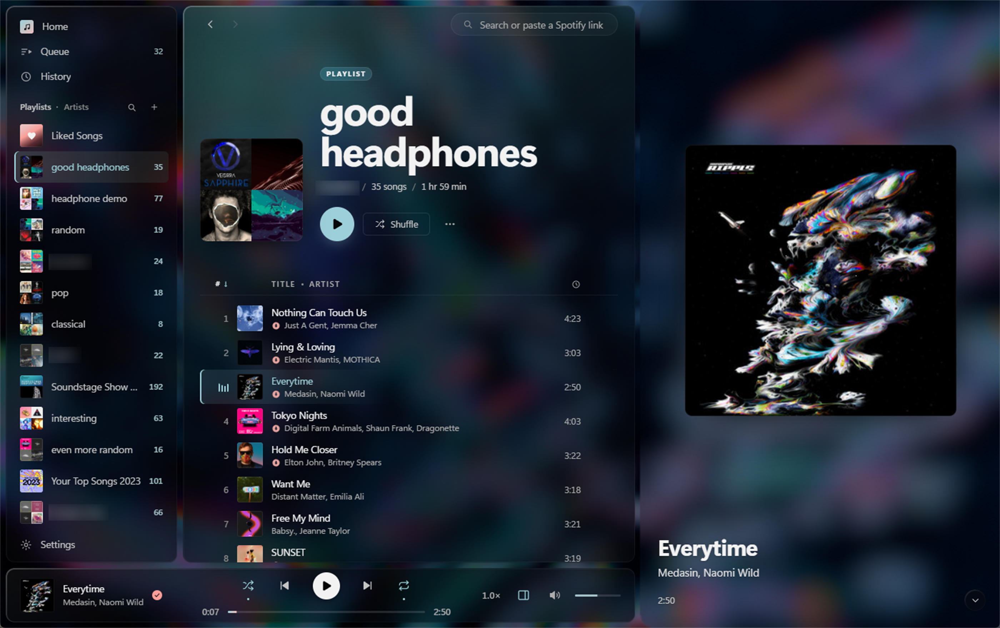
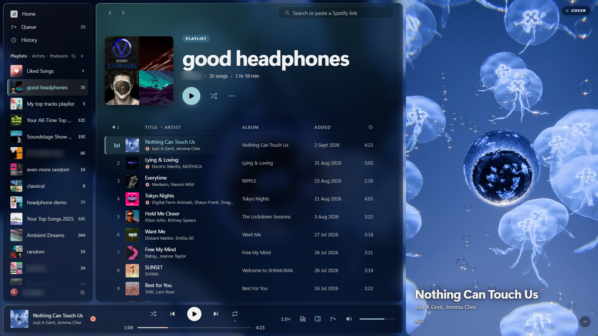

# Renderer

A quiet, music-first Spotify client for Windows and macOS.

I built it because the official desktop app used more CPU than a music player
has any business using. On my liquid-cooled Ryzen 9 5950X it would push the
CPU to 80 °C, hotter than all-core benchmarks get it, and every time a song
started the fans spun up loud enough to hear through open-back headphones. A
music player sits open all day. It should be silent.

So this one is built around being cheap to run, calm to look at, and quick to
use, and it leaves out everything that isn't music.

<p align="center">
  
  <br><br>
  
</p>

## Install

You need a Spotify Premium account. On first launch the app opens the Spotify
login in your browser.

- **Windows:** download the setup `.exe` from [Releases](../../releases) and
  run it.
- **macOS 14+ (Apple Silicon):** download `renderer-macos-aarch64.zip` from
  [Releases](../../releases), extract `renderer.app` and open it. The app is
  ad-hoc signed, not notarized, so Gatekeeper may ask you to approve it. Only
  do that for builds you trust.

From v0.1.19 on, Settings can check for and install updates. Install v0.1.19
itself by hand.

## Not affiliated with Spotify

This is an unofficial client with no connection to Spotify AB. "Spotify" is
their trademark and is used here only to say what this connects to.

Running an unofficial client very likely breaks Spotify's Terms of Use. This one
authenticates as a desktop client and uses internal endpoints that aren't part of
the public Web API, so it can get your account suspended. It needs your own
Premium account and gives you nothing you aren't already paying for. Your call.
No audio, metadata or artwork ships with this repository.

## Features

Mostly a normal client: playlists, albums, artist pages, search, queue,
credits, radio, and profiles.

The pages only contain the music parts. An artist page has the discography,
popular tracks, bio, monthly listeners and top cities. No merch, no concert
tickets, no AI DJ, no home feed. Audio podcasts are there, out of the way;
video podcasts and audiobooks aren't.

The interface is frosted glass lit by whatever is playing: a still haze taken
from the song's Canvas or cover. It changes with the song and costs nothing
while the song plays.

Audio is 320 kbps and gapless. Media keys work when the app isn't focused, and
it shows up in Windows Quick Settings and on the lock screen. Played songs are
cached, so replaying them uses no network. Podcast episodes are streamed through
temporary seekable files, not kept in the offline audio cache. When the system's
audio output changes, local playback follows it. It can launch at login, minimized if you want.
Playlists can be created, renamed, deleted and reordered, and tracks added or
removed by drag and drop or in bulk by rules (artist, album, title, length),
with a preview of exactly which entries go. Playlists can be pinned to the top
of the library, and folders are kept. Settings has an audio cache size limit
and volume normalisation.

Some extra things I added because we control playback here:

- Paste a shared Spotify link (song, album, artist, playlist, podcast, episode
  or profile) into search, and it opens here instead of the web player.
- Cut a section out of a song, or loop an exact range. Set per playlist, edited
  in a waveform view.
- Playback speed from 0.5× to 4×, pitch preserving.
- Listening history, kept locally.
- A mark on songs that are already in the local audio cache.

Canvas works, but only if you have it enabled in the real Spotify app. It's
an account setting on their servers, not a local one, and their backend returns
nothing at all while it's off. You still get the album cover, of course.

Show pages load all resolved episode metadata before displaying the list, but
render only the visible rows. Search matches episode titles and descriptions
across that complete result. Episodes default to newest first; oldest first and
title sorting are also available. Play follows the filtered, sorted order and
skips unavailable episodes.

Podcast streaming does not synchronously cache the whole episode on Play. Its
temporary file can reserve the full logical size before those bytes arrive,
and streaming prefetch can still download ahead, even a whole episode during
preload or while paused. Episode files left by older versions are ignored, not
specially deleted; they can occupy cache space until normal pruning or you
clear the audio cache.

### Likes, follows and devices (optional)

The normal sign-in can read Liked Songs and the artists you follow, but can't
change them. To like songs, follow artists and people, see your saved podcasts,
and play Renderer on your other Spotify devices, connect your own Spotify
developer app. It's a second authorization for the same account, not another account.

1. Create an app in the [Spotify developer dashboard](https://developer.spotify.com/dashboard)
   with your Premium account.
2. Add `http://127.0.0.1:5589/personal-api/callback` as its redirect URI.
3. Paste the app's Client ID into Settings. Only the Client ID: never the
   Client Secret.

Allow Spotify Connect access in Settings, then choose an output from the player
bar. Renderer pauses local audio before starting the selected phone, speaker
or Spotify app. New queues and playback controls use that selected output,
and its playback state is synchronized only while it is selected. Choosing
**This computer** pauses the remote output and restores the current queue and
position locally, paused; press Play to resume here. No local Connect device
ID is required.

Spotify devices play Spotify's original audio: Renderer's playback speed and
track-editor previews require **This computer**. Device availability, Spotify
permissions, Premium and developer-app restrictions still apply. Failed remote
commands remain visible and do not silently start local audio. If the old device
cannot be paused when returning, Renderer still unlocks the output selector and
stays paused; stop that device in Spotify before resuming locally.

## Limitations

This isn't meant to replace the Spotify app. It's a daily player, with enough
discovery in it that you don't have to leave for that, but there will be things
you occasionally need the real app for.

Windows and macOS 14 or later only, and you need Spotify Premium.

No lossless. Spotify has it and the official app plays it, but this client isn't
offered it: the track metadata we get back lists AAC 24 and Ogg Vorbis
96/160/320 and no FLAC. It's gated on presenting as a client they serve it to,
which would take far heavier reverse engineering than anything else here, if
it's reachable at all.

It doesn't matter much in practice. 320 kbps Vorbis and lossless aren't
something people reliably pick apart in a blind ABX test. There's a difference
on paper, but not at a level that affects listening.

## Building

You need [Rust](https://rustup.rs) and [Bun](https://bun.sh). Build on the OS
you intend to run. Cargo compiles every dependency from source, so the build
directory ends up several GB. On macOS, install the Xcode Command Line Tools
(`xcode-select --install`) and use macOS 14 or later.

```bash
bun install
bun tauri build
```

The installer lands in `target/release/bundle/nsis/` on Windows, and the app in
`target/release/bundle/macos/` on macOS. The build packages the playback engine
alongside the app. For development, build the engine once with
`bun run build:engine`, then run `bun tauri dev`.

The checks are `cargo test -p renderer-engine`, `cargo test -p renderer`,
`bun test` and `bun run build`.

Publishing a GitHub release runs the [release workflow](../../actions/workflows/macos-build.yml),
which builds, tests and signs both platforms and attaches the installers and
the update files.

Your login and caches stay on your computer, under `%LOCALAPPDATA%\SpotifyRenderer`
on Windows or `~/Library/Application Support/SpotifyRenderer` on macOS. The
optional developer-app authorization is kept in the system's credential store.
Neither sign-in gives this project your Spotify password.

### UI harness

`dev/ui-harness.html` runs the interface in a browser. With `?real` it reads
your actual library from the running app instead of fixture data. Quit the app,
start `bun run dev --host 127.0.0.1`, run `bun dev/real-app.js`, then open
`http://127.0.0.1:1420/dev/ui-harness.html?real`. Playback there is
simulated, and account changes are refused.

That app copy opens a local debugging port that any program on your computer
can use to control it, so close it when you're done.

## How it works

It has to be cheap to run while sitting open all day, so a few things follow
from that. The playhead is animated with a transform instead of a width, so it
doesn't force layout on every tick. Long lists are virtualized. The engine sends
a small position update on each heartbeat rather than the whole state.

The glass doesn't re-blur the window as things move. The haze is rendered once
per song on the GPU, in a worker, and the panes show a pre-frosted copy of it,
so nothing is redrawn while the song plays.

Two processes. `engine/` wraps [librespot](https://github.com/librespot-org/librespot)
and handles everything to do with sound. The Tauri shell in `src-tauri/`
supervises it, holds the caches, and serves a Svelte 5 frontend from `src/`.
Audio being in its own process means the interface can't interrupt playback, and
if the engine dies the shell restarts it and puts the queue back.

Tauri and a web frontend are an odd pick for this. I used them because the UI
needed the most iteration and HTML and CSS were much faster to work in.
Rewriting the frontend lower-level would be straightforward to hand to agents
now, but it's already light enough that I'd rather keep it easy to change.

| Path         | What's in it                                                |
| ------------ | ----------------------------------------------------------- |
| `engine/`    | Playback engine: librespot, audio pipeline, browse, history  |
| `src-tauri/` | Tauri shell: engine supervision, caches, commands            |
| `src/`       | Svelte 5 frontend                                            |
| `dev/`       | Scratch harnesses, not part of the build                     |

`AGENTS.md` has the conventions the code follows, and is a better starting point
than this file if you want to change something.

### The resampling problem

librespot's rodio backend has a resampling bug that shows up on Windows. Spotify
decodes at 44.1 kHz and Windows usually runs its output at 48 kHz, so everything gets
resampled on the way out. rodio does that with linear interpolation, and it also
rebuilds its converter mid-stream, leaking a fraction of a frame each time it
does. At the packet sizes Spotify's Vorbis actually produces that came to
+0.4882% more output frames than there should be, measured offline and then
again on hardware. Extra frames at a fixed device rate means the audio is
stretched, so everything plays slightly slow and slightly flat.

Both halves needed replacing. There's a polyphase windowed-sinc resampler that
tracks position as an exact rational, so the output frame count is determined to
the frame regardless of where packet boundaries land, and the sink reports the
device's rate rather than 44.1 kHz, which sends rodio's own converters down their
pass-through path so they stop resampling the result a second time. Linear
interpolation measured −15 dB error at 10 kHz; this measures −116 dB. Both
numbers are pinned by tests.

## On the code

Nearly all of it was written by AI agents. The decisions about what to build and
how weren't left to them, and plenty of it got thrown out and redone.

It's an easy codebase to extend. If Spotify is missing something you want, point
an agent at it.

## License

MIT, see [LICENSE](LICENSE). Covers the code here and nothing belonging to
Spotify AB.
